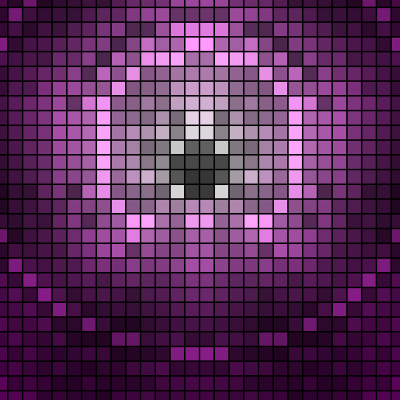
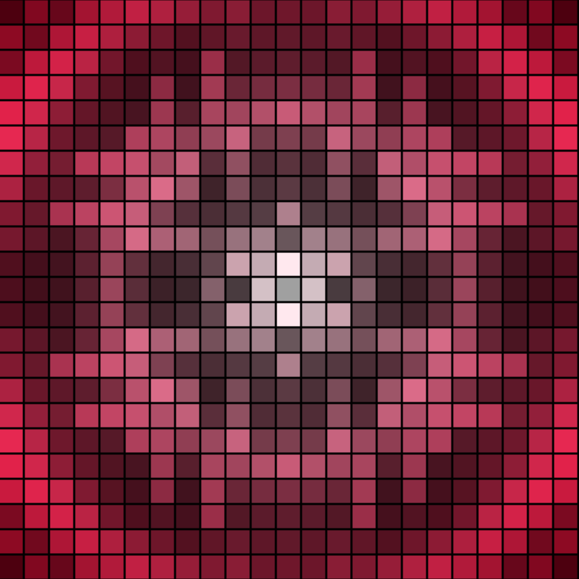
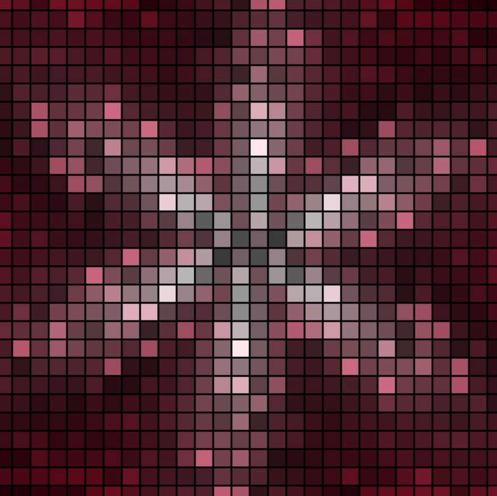
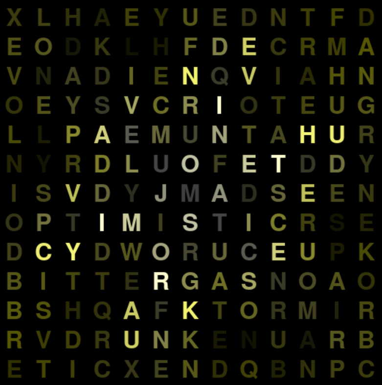

# C A L L O S U M

#### Reese Turney & Ryan Vandersmith

Discover why your brain loves the music you choose.

## Research Notebooks

- [Feature visualization & normalization](https://colab.research.google.com/drive/1-VmrEH0rXGvLicN42oUaHNJ9iAtdiNvi?usp=sharing)
- [Spotify & LyricsGenius pipeline](https://colab.research.google.com/drive/1t1VCc48UUFzdaarYhQ9UIRrVgQMS20PC?usp=sharing)
  (requires permission)

## Visualizer Screenshots

### Disco:

### Country:

### Pop:

### Lyrical word-search:

